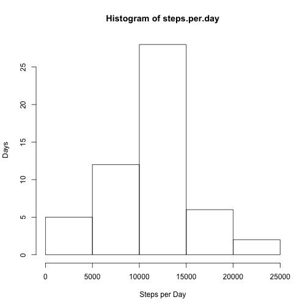
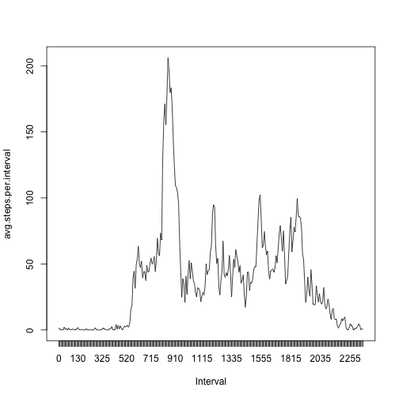
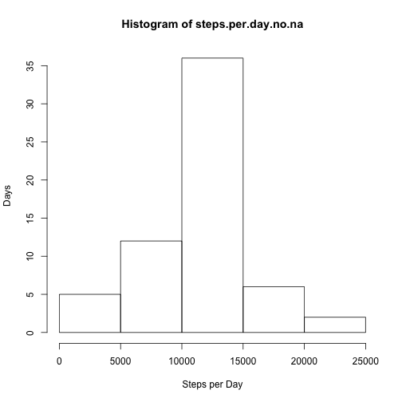
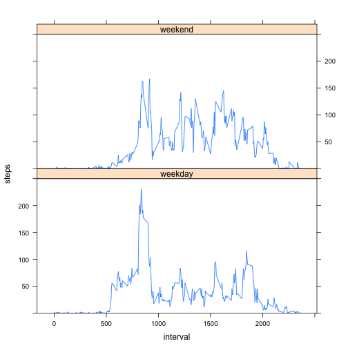

# Reproducible Research: Peer Assessment 1


## Loading and preprocessing the data
Unzip activity.zip file and load data 

```r
unzip("activity.zip")
activity.data <- read.csv("activity.csv")
```
## What is mean total number of steps taken per day?
Calculate the total steps per day. Show histogram.

```r
steps.per.day = tapply(activity.data$steps, activity.data$date, sum)
hist(steps.per.day, xlab="Steps per Day", ylab="Days")
```

 
Calculate mean and median.

```r
mean(steps.per.day, na.rm=TRUE)
```

```
## [1] 10766
```

```r
median(steps.per.day, na.rm=TRUE)
```

```
## [1] 10765
```

## What is the average daily activity pattern?
Overall pattern of steps averaged from all days 

```r
avg.steps.per.interval = tapply(activity.data$steps, activity.data$interval, mean, na.rm=TRUE)
plot(avg.steps.per.interval, type="l", xaxt="n", xlab="Interval")
axis(1, at=1:length(avg.steps.per.interval), labels=dimnames(avg.steps.per.interval)[[1]])
```

 

The interval with the maximum number of steps (on average). note: interval is displayed first, then the index. 

```r
which.max(avg.steps.per.interval)
```

```
## 835 
## 104
```
and the maximum for that interval

```r
avg.steps.per.interval[which.max(avg.steps.per.interval)]
```

```
##   835 
## 206.2
```

## Imputing missing values
how many steps values are NA?

```r
sum(is.na(activity.data$steps))
```

```
## [1] 2304
```
how many date values are NA?

```r
sum(is.na(activity.data$date))
```

```
## [1] 0
```
how many interval values are NA?

```r
sum(is.na(activity.data$interval))
```

```
## [1] 0
```

Fill in the NA step values with the average interval value. Compare plot of data with NA values to data with NA values replaced.

```r
activity.data.na.replaced = activity.data
for (index in which(is.na(activity.data.na.replaced))) activity.data.na.replaced[index, "steps"] <- avg.steps.per.interval[as.character(activity.data.na.replaced[index, "interval"])]
```
Calculate the total steps per day of data with NA values replaced. Show histogram. Notice the histogram shape is different from the first histogram -- the middle bin has more values. In other words, the histogram is taller in the middle.

```r
steps.per.day.no.na = tapply(activity.data.na.replaced$steps, activity.data.na.replaced$date, sum)
hist(steps.per.day.no.na, xlab="Steps per Day", ylab="Days")
```

 

Calculate mean and median of data with NA values replaced. By using the average interval values to fill in the NA values, the mean and median are almost unchanged. The mean stayed the same at 10766, and the median changed from 10765 to 10766. 

```r
mean(steps.per.day.no.na)
```

```
## [1] 10766
```

```r
median(steps.per.day.no.na)
```

```
## [1] 10766
```

## Are there differences in activity patterns between weekdays and weekends?

To get data factored into weekday and weekend: set a new column "dayofweek" to "weekday" for all days, then set "dayofweek" to "weekend" for the dates that are Saturday or Sunday. 

```r
activity.data.na.replaced$dayofweek <- "weekday"
  
activity.data.na.replaced[weekdays(as.Date(activity.data.na.replaced$date)) %in% c("Saturday", "Sunday"), ]$dayofweek <- "weekend"
```

View the average steps per interval conditioned on the "dayofweek". The weekday graph shows a spike in the morning compared to the weekend graph. 

```r
install.packages("lattice", repos="http://cran.rstudio.com/")
```

```
## 
## The downloaded binary packages are in
## 	/var/folders/69/hcm8ps5d0kx1w6qtqy5zmfvm0000gn/T//RtmpEnw5aS/downloaded_packages
```

```r
library(lattice)
xyplot(steps ~ interval | dayofweek, data = activity.data.na.replaced, type="a", ylim=c(0,250), layout=c(1,2))
```

 
